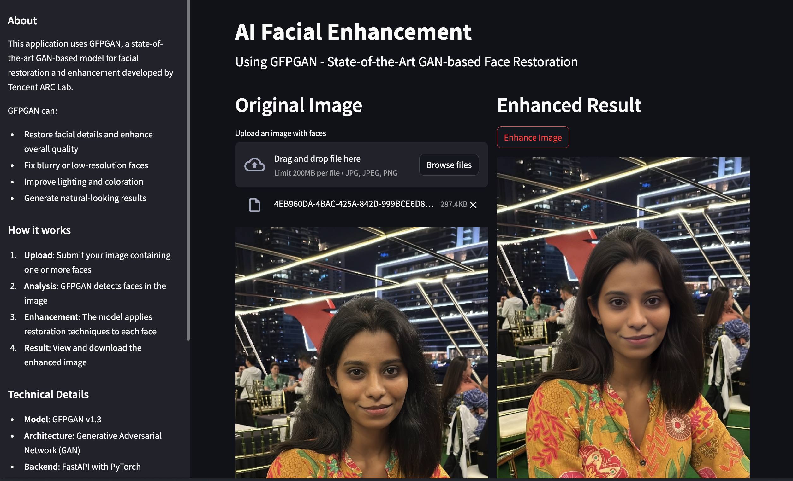
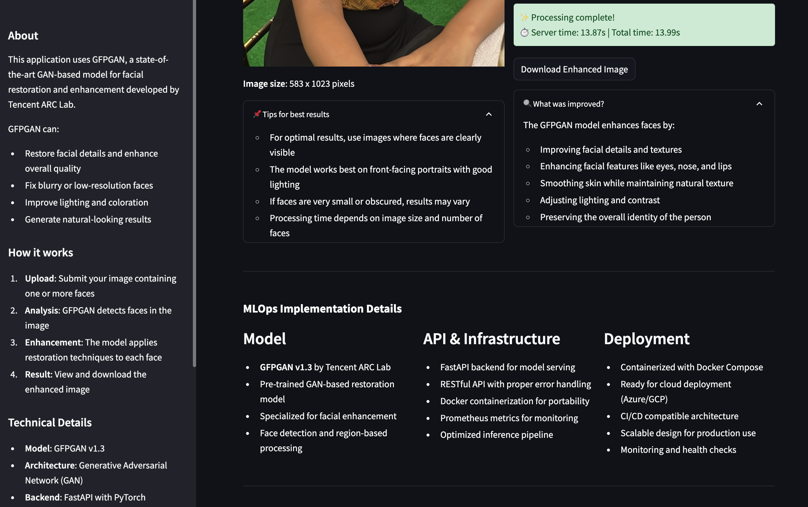

# Refaceit: An AI Facial Enhancement System

A complete MLOps project demonstrating the deployment of a facial enhancement AI system using GFPGAN, containerized with Docker and ready for cloud deployment.




## Project Overview

This project implements a facial enhancement application that demonstrates MLOps best practices including:

- Production deployment of the GFPGAN model for facial restoration
- Containerization with Docker and Docker Compose
- Cloud-ready architecture for GCP/Azure deployment
- Monitoring and logging
- CI/CD pipeline implementation

## Features

- Upload facial images for AI enhancement
- Real-time processing using state-of-the-art GFPGAN model
- Responsive Streamlit UI
- FastAPI backend for efficient model serving
- Complete containerized solution
- Monitoring with Prometheus and Grafana

## Technology Stack

- **Frontend**: Streamlit
- **Backend**: FastAPI
- **AI Model**: GFPGAN v1.3 (GAN-based face restoration)
- **Containerization**: Docker & Docker Compose
- **Monitoring**: Prometheus & Grafana
- **CI/CD**: GitHub Actions
- **Cloud-Ready**: Designed for GCP or Azure deployment

## Getting Started

### Prerequisites

- Docker and Docker Compose
- Python 3.9+ (for local development)
- Git

### Quick Start with Docker

1. Clone the repository:
   ```bash
   git clone https://github.com/poorvajasathasivam/refaceit.ai.git
   cd refaceit.ai

2. Download model weights:
```bash
./scripts/download_model.sh 
```

3. Start the application with Docker Compose:
```bash 
docker-compose up
```

4. Access the application:

```bash
Frontend: http://localhost:8501
Backend API: http://localhost:8000/docs
Prometheus: http://localhost:9090
Grafana: http://localhost:3000 (admin/admin)
```

### Local Development with Conda

1. Set up Conda environments:
```bash
./scripts/setup_conda.sh
```

2. Download model weights:
```bash
./scripts/download_model.sh
```

3. Run the backend in one terminal:
```bash
conda activate facial-enhancement
cd backend
uvicorn app:app --reload
```

4. Run the frontend in another terminal:
```bash
conda activate facial-enhancement-frontend
cd frontend
streamlit run streamlit_app.py
```

### Implementation Details
#### GFPGAN Model
The system uses GFPGAN v1.3, a state-of-the-art GAN-based model for face restoration:

- Developed by Tencent ARC Lab
- Capable of restoring facial details and enhancing quality
- Specialized for portrait restoration and enhancement
- Pretrained on diverse facial datasets

#### FastAPI Backend
The backend service provides:

- RESTful API for image enhancement
- Efficient model loading and inference
- Health check endpoints for monitoring
- Prometheus metrics for performance tracking
- Error handling and logging

#### Streamlit Frontend
The user interface offers:

- Intuitive image upload functionality
- Side-by-side comparison of original and enhanced images
- Processing time statistics
- Downloadable results
- System status indicators

#### Docker Integration
The application is fully containerized:

- Multi-container setup with Docker Compose
- Optimized Dockerfiles for both services
- Volume mapping for model weights
- Health checks for container orchestration
- Network configuration for service communication

#### Monitoring Solution
The monitoring stack includes:

- Prometheus for metrics collection
- Grafana for visualization
- Custom dashboards for system performance
- Alerting capabilities for system health

#### Cloud Deployment
This project is designed to be deployable to cloud platforms.

**GCP Deployment**:

- Use Cloud Run for containerized services
- Store model weights in Cloud Storage
- Set up Cloud Monitoring for observability
- Utilize Artifact Registry for container images

### Future Enhancements

1. Add user authentication for personalized history
2. Implement A/B testing for model improvements
3. Add support for video enhancement
4. Develop a mobile application interface
5. Implement automatic model updating

### Performance Considerations

1. The GFPGAN model requires significant GPU resources for optimal performance.
2. CPU inference is supported but will be slower
3. First-time model loading may take a few seconds
4. Processing time depends on image size and facial complexity


### Acknowledgements

GFPGAN model developed by Tencent ARC Lab.

Built with FastAPI, Streamlit, PyTorch, and Docker.

